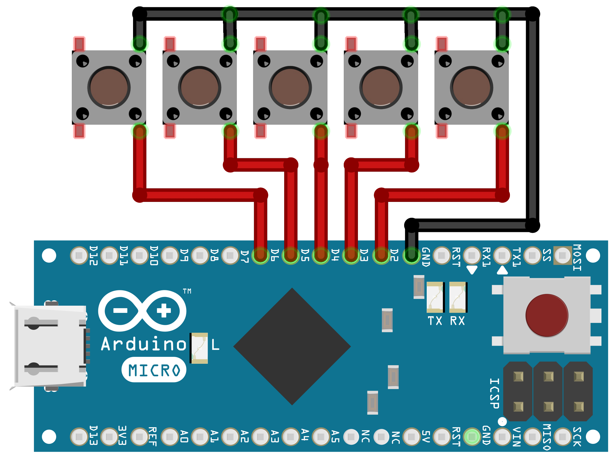
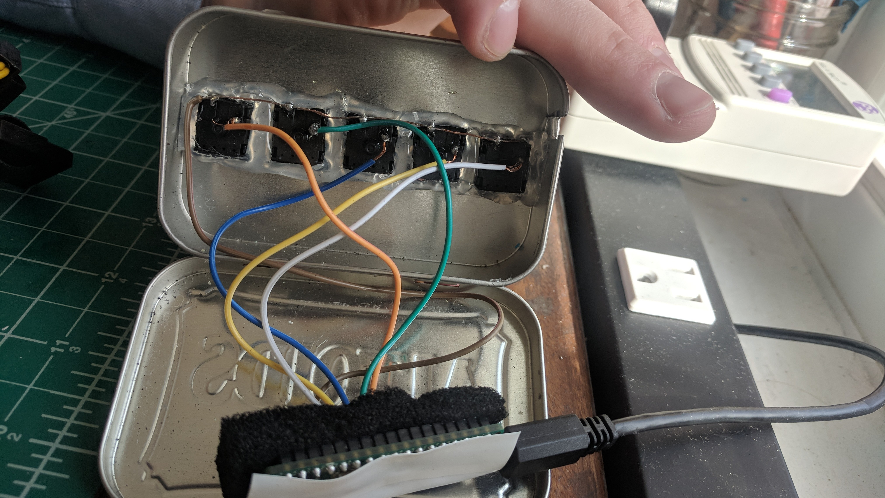
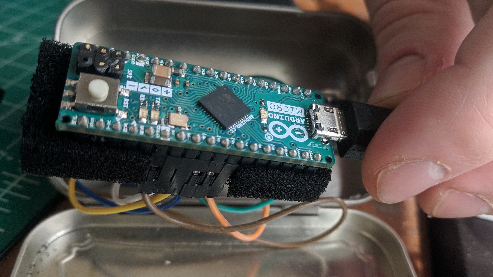

# OBS Macro Scene Switcher                                                              

$150 streamdeck - seriously?! Switch scenes on the cheap.

## Cost

| Cost   | Item              |
|--------|-------------------|
| $7.98  | Keyboard Switches |
| $1.99  | Altoids           |
| $19.99 | Arduino Micro     |
| $29.96 | Total             |

## Hardware

Connect five switches from digital pins `2`, `3`, `4`, `5`, `6` to ground as shown. When the switch is pressed - the pin is pulled logic low triggering the button press!

## Software

Next connect the arduino to your computer with a usb cable. Open the included `.ino` project with the Arduino IDE. Press "upload" to program your arduino. Make sure the board is correctly detected in Tools > Board Manager.

## Configure OBS

In your OBS project create 5 scenes - for example `Scene1` `Scene2` `Scene3` `Scene4` `Scene5`. Go to File > Settings > Hotkey and scroll down to scene controls. Under each scene set "Switch to scene" hotkey to be the desired key. 
`Control + 1`
`Control + 2`
`Control + 3`
`Control + 4`
`Control + 5`

With the obs-macro-scene-switcher connected via USB - press one of the 5 buttons to switch between scenes. Good work!

